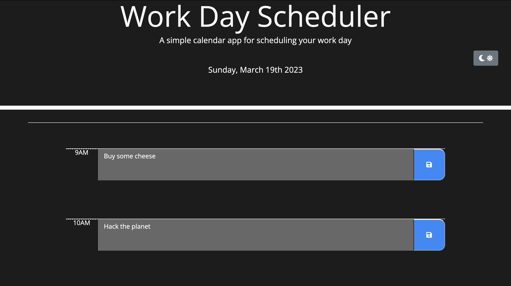

# Daily Planner App

A simple calendar app for scheduling your work day.  

## Table of Contents

- [Daily Planner App](#daily-planner-app)
  - [Table of Contents](#table-of-contents)
  - [Introduction](#introduction)
  - [Features](#features)
  - [Technologies Used](#technologies-used)
  - [Installation](#installation)
  - [Live Deployment](#live-deployment)
  - [Contributing](#contributing)
  - [License](#license)

## Introduction

The Daily Planner App is a simple web application that helps you keep track of your daily tasks and appointments. It features a clean, easy-to-use interface that lets you add, edit, and delete events quickly and easily.

## Features

The Daily Planner App comes with a variety of features designed to help you manage your work day, including:

- **Customizable time blocks:** The app allows you to add and edit events for each hour of your work day. You can add as many events as you need, and the app will automatically update the time blocks to reflect your schedule.

- **Dark mode:** The app features a dark mode that makes it easier to use in low-light conditions. Simply toggle the dark mode switch to turn it on or off.

- **Automatic color coding:** The app automatically colors each time block based on the current time. Past events are colored gray, current events are colored red, and future events are colored green.

- **Event persistence:** The app stores your events in local storage, so they remain even after you close the app. This makes it easy to pick up where you left off.

- **Toastr notifications:** The app uses Toastr to display notifications when you save an event. This lets you know that your event was successfully saved.

## Technologies Used

The Daily Planner App was built using the following technologies:

- HTML
- CSS
- JavaScript
- jQuery
- Bootstrap
- Moment.js
- Toastr

## Installation

To run the Daily Planner App locally, follow these steps:

1. Clone the repository to your local machine using the following command: `git clone https://github.com/DrGunbot/Daily-Planner-App.git`

2. Navigate to the root directory of the project.

3. Open the `index.html` file in your web browser.

## Live Deployment

The Daily Planner App is deployed live on GitHub Pages. You can access it using the following link:

[https://drgunbot.github.io/Daily-Planner-App/](https://drgunbot.github.io/Daily-Planner-App/)

## Contributing

If you'd like to contribute to the Daily Planner App, feel free to fork the repository and submit a pull request. Any contributions are greatly appreciated!

## License

The Daily Planner App is licensed under the [MIT License](https://github.com/DrGunbot/Daily-Planner-App/blob/main/LICENSE). Feel free to use, modify, and distribute the code as you see fit.

